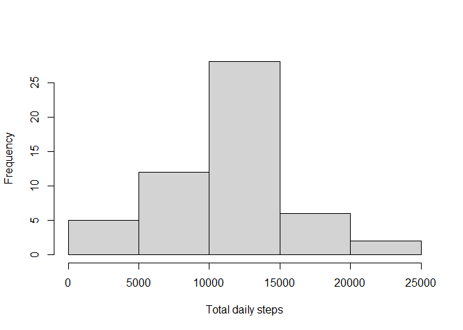
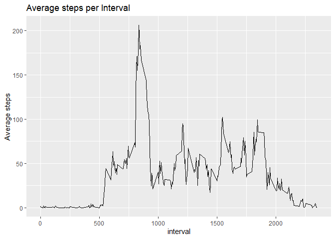
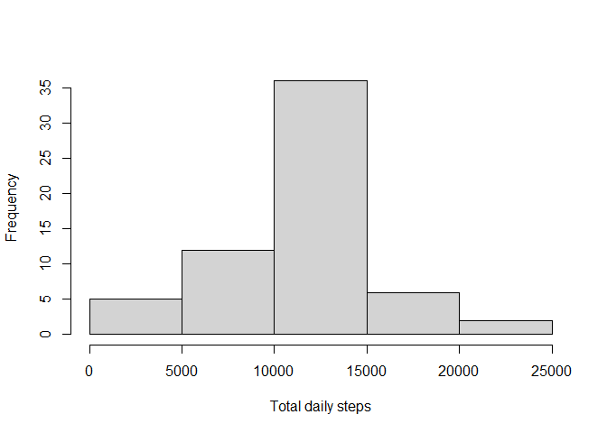
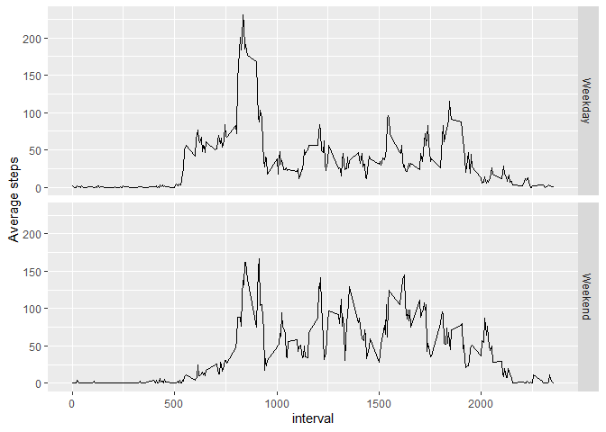

## Loading and preprocessing the data
Before starting, the "ggplot2", "dplyr", and "lubridate" libraries were loaded.

```r
library(ggplot2)
library(dplyr)
```

```
## 
## Attaching package: 'dplyr'
```

```
## The following objects are masked from 'package:stats':
## 
##     filter, lag
```

```
## The following objects are masked from 'package:base':
## 
##     intersect, setdiff, setequal, union
```

```r
library(lubridate)
```

```
## 
## Attaching package: 'lubridate'
```

```
## The following objects are masked from 'package:base':
## 
##     date, intersect, setdiff, union
```
Next, the data was loaded:

```r
activity <- read.csv("activity.csv", check.names = TRUE)
```
The structure of the data is presented.

```r
str(activity)
```

```
## 'data.frame':	17568 obs. of  3 variables:
##  $ steps   : int  NA NA NA NA NA NA NA NA NA NA ...
##  $ date    : chr  "2012-10-01" "2012-10-01" "2012-10-01" "2012-10-01" ...
##  $ interval: int  0 5 10 15 20 25 30 35 40 45 ...
```
The data has three variables, steps, date, interval.  The step and interval variables are integers and the date is character.  The interval variable needs to be converted to a numeric variable to enable time series (line) graphing over that variable.

```r
activity$interval <- as.numeric(activity$interval)
```

## What is mean total number of steps taken per day?
The following code was used to calculate the total steps per day and the output is below the code.

```r
totaldaystep <- aggregate(steps~date,data=activity,sum)
totaldaystep
```

```
##          date steps
## 1  2012-10-02   126
## 2  2012-10-03 11352
## 3  2012-10-04 12116
## 4  2012-10-05 13294
## 5  2012-10-06 15420
## 6  2012-10-07 11015
## 7  2012-10-09 12811
## 8  2012-10-10  9900
## 9  2012-10-11 10304
## 10 2012-10-12 17382
## 11 2012-10-13 12426
## 12 2012-10-14 15098
## 13 2012-10-15 10139
## 14 2012-10-16 15084
## 15 2012-10-17 13452
## 16 2012-10-18 10056
## 17 2012-10-19 11829
## 18 2012-10-20 10395
## 19 2012-10-21  8821
## 20 2012-10-22 13460
## 21 2012-10-23  8918
## 22 2012-10-24  8355
## 23 2012-10-25  2492
## 24 2012-10-26  6778
## 25 2012-10-27 10119
## 26 2012-10-28 11458
## 27 2012-10-29  5018
## 28 2012-10-30  9819
## 29 2012-10-31 15414
## 30 2012-11-02 10600
## 31 2012-11-03 10571
## 32 2012-11-05 10439
## 33 2012-11-06  8334
## 34 2012-11-07 12883
## 35 2012-11-08  3219
## 36 2012-11-11 12608
## 37 2012-11-12 10765
## 38 2012-11-13  7336
## 39 2012-11-15    41
## 40 2012-11-16  5441
## 41 2012-11-17 14339
## 42 2012-11-18 15110
## 43 2012-11-19  8841
## 44 2012-11-20  4472
## 45 2012-11-21 12787
## 46 2012-11-22 20427
## 47 2012-11-23 21194
## 48 2012-11-24 14478
## 49 2012-11-25 11834
## 50 2012-11-26 11162
## 51 2012-11-27 13646
## 52 2012-11-28 10183
## 53 2012-11-29  7047
```
Here is a histogram to show the distribution of the total steps by date.


```r
hist(totaldaystep$steps, xlab = "Total daily steps",main="")
```

<!-- -->

Next the mean and median for the total number of steps taken per day is calculated.

```r
meandailytotal <- mean(totaldaystep$steps)
mediandailytotal <- median(totaldaystep$steps)
```

The mean total number of steps taken per day is 10766.2 and the median total number of steps taken per day is 10765.0.

## What is the average daily activity pattern?
To investigate this question, we first calculate the mean for each interval across all dates.

```r
avestepint <- aggregate(steps~interval, data=activity, mean)
```

This chart shows the average number of steps taken for each five minute interval.

```r
ggplot(avestepint, aes(y=steps, x=interval)) +
        ggtitle("Average steps per Interval") +
        geom_line() + ylab("Average steps")
```

<!-- -->

```r
#find interval of max steps
maxavesteps <- max(avestepint[,2])
maxint <- avestepint$interval[avestepint$step==maxavesteps]
```

The interval with the maximum number of steps on average across all the days in the data set is 835.

## Imputing missing values
First, let's determine the total number of missing values in the dataset.

```r
missingsteps <- sum(is.na(activity$steps))
```

There are 2304 intervals missing step counts.

In order to complete the data set, the NA steps values will be replaced by the average number of steps for that interval, using the averages by interval which were found in the previous step.  The code follows.

```r
## copy activity to new dataset
modactivity <- activity
## Replace NAs in step by the average, going by rows.
for(i in 1:length(modactivity$steps)) {
        if(is.na(modactivity$steps[i]))  
           modactivity$steps[i] <- avestepint$steps[
                  avestepint$interval==modactivity$interval[i]]
}
```

Now we will use the new data set to make a new histogram with the total number of steps per day.

```r
modtotaldaystep <- aggregate(steps~date,data=modactivity,sum)
hist(modtotaldaystep$steps, xlab = "Total daily steps",main="")
```

<!-- -->

```r
modmeandailytotal <- mean(modtotaldaystep$steps)
modmediandailytotal <- median(modtotaldaystep$steps)
```

The mean total number of steps taken per day is 10766.2 and the median total number of steps taken per day is 10766.2.

By replacing the missing values with the averages for those intervals, more counts were in the middle class, showing reduced variability.  The means for both data sets are the same, and the median is very close to the same value.  Additionally, the median of the modified data set is equal to the mean.

## Are there differences in activity patterns between weekdays and weekends?
In order to investigate this question, a factor variable, day, needs to be created.

```r
modactivity$day <- weekdays(as.Date(modactivity$date, format = "%Y-%m-%d"))
modactivity$day <- with(modactivity,ifelse(day =="Saturday" | day == "Sunday", "Weekend", "Weekday"))
```

Next, the mean steps for each day and interval combination will be calculated.

```r
avedayint <- modactivity %>% group_by(day,interval) %>% summarise(mean_steps = mean(steps))
```

```
## `summarise()` has grouped output by 'day'. You can override using the `.groups`
## argument.
```

Finally, the average number of steps by type of day (weekday/weekend) by interval is plotted.

```r
ggplot(avedayint,aes(x=interval, y=mean_steps)) + facet_grid(day ~ .) + 
        geom_line() + ylab("Average steps")
```

<!-- -->

The graphs show that there are less steps in the early hours on weekends.
